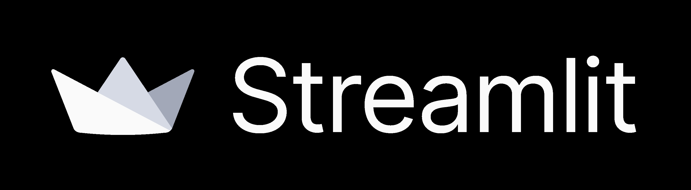
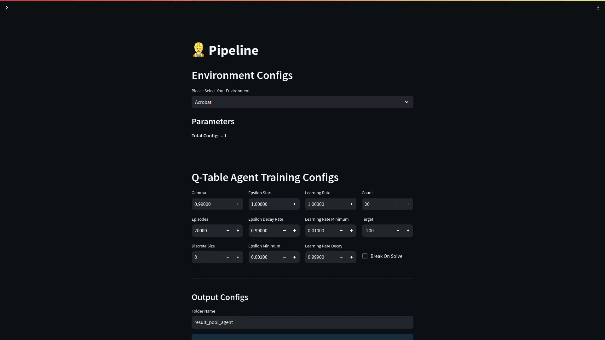
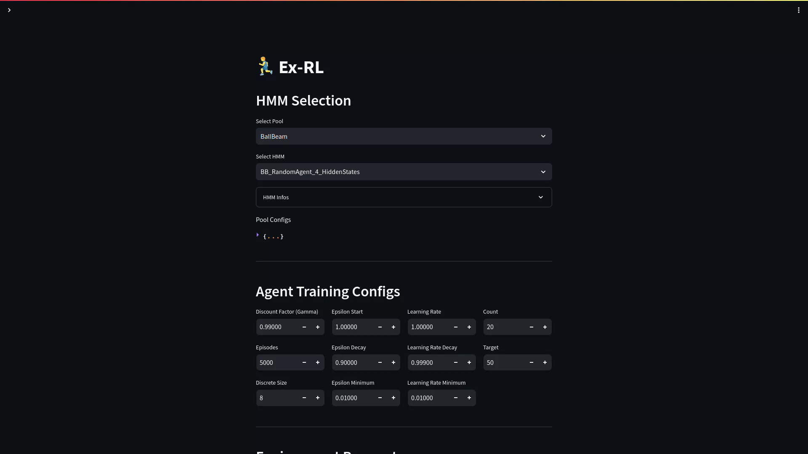

<div align="center">

# Ex-RL Virtual Laboratory 🧪





👋 welcome to the official repository of **_[Ex-RL: Experience-Based Reinforcement Learning]()_**

</div>

## 📖 Table of Contents

- [⚙️ Setup](#setup)
- [📄 Pages](#pages)
- [👥 Contributors](#contributors)
- [🗣️ Citation](#citation)

* <details>
      <summary>
          <a href="#doc">
          🔨 Environment Documentation
          </a>
      </summary>

    - [`create.py`](#createpy)
    - [`encoders`](#encoders)
    - [Encoder](#encoder)
    - [`__init__.py`](#init)
    - [🖊️ Register & `EnvSelector`](#register)

</details>

<a name="setup"></a>

## ⚙️ Setup

<a name="manual"></a>

```bash
git clone https://github.com/mhyrzt/ballbeam-gym.git
git clone https://github.com/alighandij/Ex-RL-virtual-lab.git 
cd Ex-RL-virtual-lab
python3 -m venv venv
# activate virtual environment
python3 -m pip install ./exrl
python3 -m pip install ../ballbeam-gym
streamlit run App.py
```

<a name="pages"></a>

## 📄 Pages

### 👷 Pipeline QTable

for Training `QTableAgents` with customized environments.



### 🎮 Review Agent

For see information of an agent and play it.


### 🕵️ HMM Trainer

For training HMM based on trained `QTableAgents`.


### 🏃‍♂️Ex-RL

To execute an Ex-RL algorithm with a trained HMM in a different environment.



<a name="contributors"></a>

## 👥 Contributors

The contributors, listed in chronological order, are:

- Ali Ghandi
- Azam Kamranian
- Mahyar Riazati

<a name="citation"></a>

## 🗣️ Citation

```bibtex

```

<a name="doc"></a>

## 🔨 Environment Documentation

for adding a new environment to pipeline create folder at `modules/environments/envs` with following structure:

```text
your_awesome_env
├── create.py
├── reward.py
├── __init__.py
└───encoders
    ├── encoder_1.py
    └─  __init__.py
```

<a name="cretepy"></a>

### `create.py`

this file should contains a function called `create` for making & customizing the environments.
_**NOTE**_: don not use `gym.create` instead use the source code from OpenAI gym unless it supports customization directly. (see `cartpole`)

```python
def create(**kwargs):
    beam_length = kwargs.get("beam_length")
    config = {
        'timestep': 0.05,
        'setpoint': 0.4,
        'beam_length': beam_length,
        'max_angle': 0.2,
        'init_velocity': 0.0,
        'action_mode': 'discrete'
    }
    env = gym.make("BallBeamSetpoint-v0", **config)
    return env
```

_**NOTE* #1*_: for using gym environments make sure you wrap them with `GymWrapper` from `exrl.gym_wrapper`.

_**NOTE #2**_: all environments should have `is_goal_reached` method.

<a name="encoders"></a>

### `encoders`

define your state encoders in this folder and then register them in `__init__.py`:

```python
from .your_awesome_encoder import your_awesome_encoder

ENCODERS = {
    "Awesome Encoder": your_awesome_encoder
}
```

<a name="encoder"></a>

### Encoder

encoder is a function that takes two arguments:

1. `samples` which is a dict contains `agent_id` and samples:

```python
samples = {
    "agent_id_1": [
        sample_1,
        sample_2,
        ...,
        sample_n
    ],
    ..., # other agents
    "agent_id_n": [
        sample_1,
        sample_2,
        ...,
        sample_n
    ],
}
```

2. `pool` for get extra information about the agent.

**_Example_**:

```python
def encoding_function(samples: dict, pool):
    sequences = []
    for agent_id, values in samples.items():
        for trajectories in values:
            slope = pool.get_agent_info(agent_id).angle_perturbation
            slope = list(slope)[0]
            encoded = encode_trajectory(slope, trajectories)
            sequences.append(encoded)
    return sequences
```

<a name="init"></a>

### `__init__.py`

describe your env like this

```python
from .create import create
from .reward import reward_shaper
from .encoder import ENCODERS

YOUR_ENV = {
    "Your Awesome Env": {
        "create": create,
        "state_shape": YOUR_ENV_STATE_SHAPE: int,
        "parameters": {
            "param_1": {
                "options": [50, 100, 150, 200, 250],
                "default": 150,
            },
        },
        "agent_configs": {
            # This Dictionary is optional
            # it only affect the Parameter Selection
            # And make it easier
            "discrete": 32,
            "count": 20,
            "target": -120
            "reward_shaper": reward_shaper
        },
        "encoders": ENCODERS
    }
}
```

<a name="register"></a>

### 🖊️ Register & `EnvSelector`

after adding your agents register your environment in `modules/environments/selector.py` like this:

```python
from .envs.your_awesome_env import YOUR_ENV
ENVIRONMENTS = {
    # OTHER ENVS
    **YOUR_ENV,
}
```

you can use `EnvSelector` To access environments configs.
